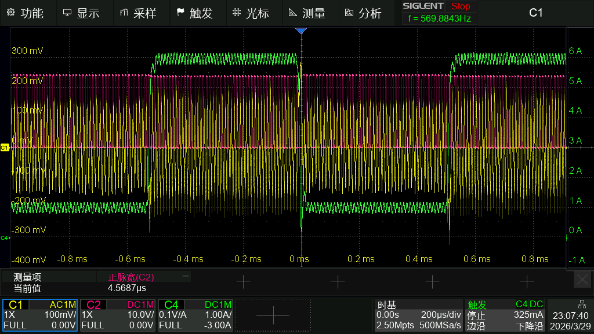
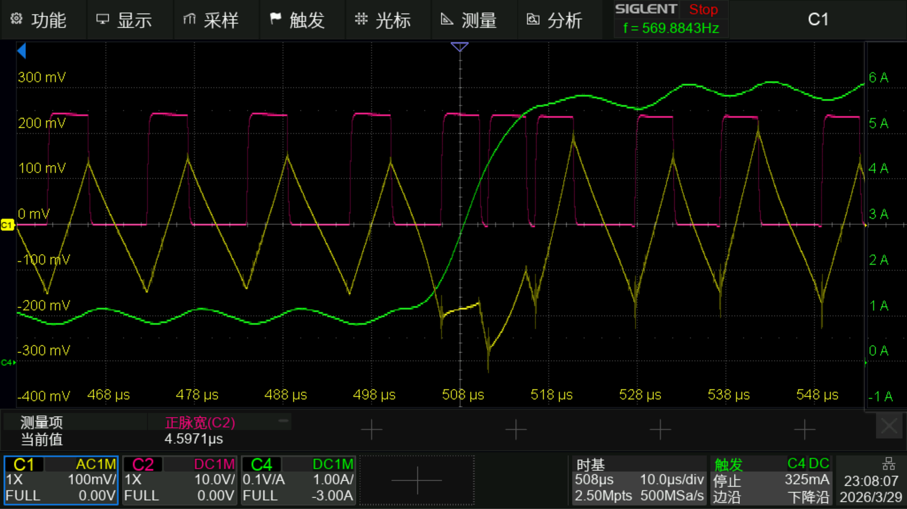
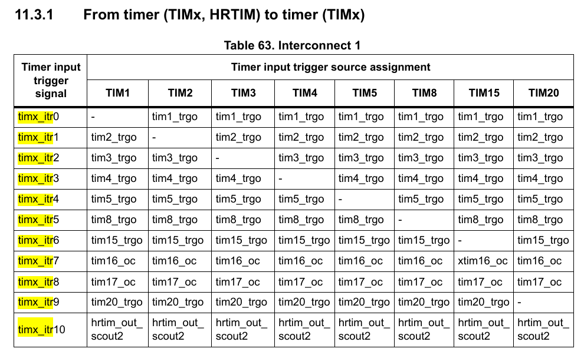

以[超级电容控制板Plus?](https://github.com/DonotFreeze/RM-PCB-SuperCapControlBoard_Plus)为原型的COT电源程序
----
# 碎碎念

常规的数字环路PI、3P3Z什么的都弱爆了！

本项目使用STM32的比较器与定时器的One Pulse功能实现了COT电源的控制，其效果符合预期。

本来想做恒流输出的，但是由于PCB是从其他项目复用的，引脚资源有冲突。所以只能做出恒压输出，恒流输出的实现方式请参考LM3100这个电源芯片芯片数据手册。

# 效果

## 瞬态响应

1-6App，1Khz，0.5A/us

黄色：输出纹波，红色：SW波形，绿色：输出电流

可以看到，COT的响应超快。

# 遇到的坑
## 定时器

### 通道输出极性问题

One Pulse模式，PWM输出的情况下，Counter Period (AutoReload Register - 16 bits value )即ARR寄存器的值决定本次计数的总时长（计数溢出后停止，等待下一次触发），向上计数模式，在PWM1模式，通道极性HIGH的情况下，正通道在空闲（没有触发）的情况下是高电平，当触发后，Cnt开始向上计数，超过Pulse (16 bits value)即CCR寄存器的值时，正通道（CHx）通道翻转（变成低电平）直到Cnt计数到ARR溢出后清零，正通道恢复高电平。正通道输出的负脉冲长度为 ( ARR - CCR ) x TCLK（反向通道则相反）。直到下一次被触发以重复此过程。

但是在COT的环境下，我们需要的是触发一次输出一个正脉冲信号，而这里是空闲高，触发后变低，那么解决方法以下几种：

1. 使用向上计数模式，PWM2模式，通道极性HIGH，这个时候正通道（CHx）空闲会变成低电平，触发后变成高电平，然后Cnt开始向下计数，直到Cnt计数到CCR后翻转（恢复低电平），此时的正脉冲长度为 ( ARR - CCR ) x TCLK。（也就是效果与上面的过程相反）。

2. 使用向下计数模式，PWM1模式，通道极性HIGH，这个时候正通道（CHx）空闲会变成低电平，触发后变成高电平，然后Cnt开始向下计数，直到Cnt计数到CCR后翻转（恢复低电平），此时的正脉冲长度为 CCR x TCLK。（效果与办法1相同）。

3. 使用反向通道（CHxN）作为上管的输入信号，正通道（CHx）作为下管输入信号，然后使用上述配置，正脉冲长度为 ( ARR - CCR ) x TCLK。

4. 使用反向通道（CHxN）作为上管的输入信号，正通道（CHx）作为下管输入信号，使用向下计数模式，PWM2模式，通道极性HIGH，此时的正脉冲长度为 CCR x TCLK。

**但是上面这几种办法均存在一个问题：当开启死区的时候，会在 触发 - 正通道（CHx）变成高电平 之间插入一死区，也就是相当于插入了一个延迟。**

**那有为什么不把输出极性改为LOW呢？**

因为输出极性改为LOW之后，死区就变成了重叠区，直接炸管。

### 启动问题

TIM1作为One pulse PWM的输出，也就是上管constant on time的信号源，正常工作下，他应该是由比较器进行触发，但是上电的时候是没有输出，也就没有纹波。所以本项目额外开启了一个TIM2，将TIM2的频率设定为正常工作的一半，使用TIM2的TRGO - Update Event作为TIM1 触发源（TIM_TS_ITR1）作为PWM的启动信号，以提供初始的开关纹波，后续当比较器稳定触发之后，将TIM1的触发源改为比较器输出（TIM_TS_ETRF）

TIM的触发信号源可通过手册进行查阅

比较器的触发信号是通过映射通道（ETRF）实现的，其中也有很多信号源可选。